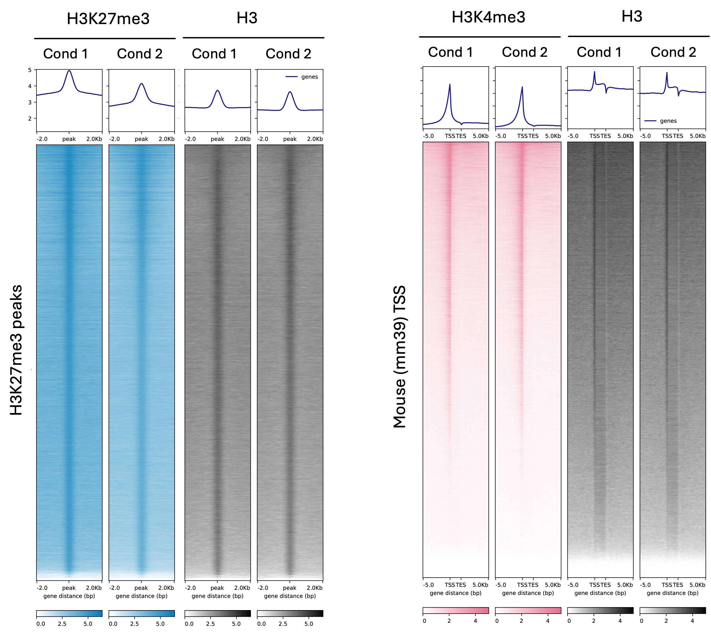

The data processing and analysis outline is here:
<br/><br/>

## Step 0 - Quality Control 

Assuming we already have the FASTQ files from the sequencing facility, what can we do with the data?

[FASTQ files](https://en.wikipedia.org/wiki/FASTQ_format) contain the nucleotide sequence of each read, along with metadata (such as read identifiers and indices) and quality scores for each base in the sequence. The kind staff at the sequencing facility might have already done these two steps:

1. Raw data assessment using [FastQC](https://www.bioinformatics.babraham.ac.uk/projects/fastqc/) and [MultiQC](https://multiqc.info/). 
2. Adapter trimming using [Trim Galore](https://www.bioinformatics.babraham.ac.uk/projects/trim_galore/) or [cutadapt](https://cutadapt.readthedocs.io/). *It is therefore important to know which adapter (pairs) were used in the library preparation.*

If you want to perform the QC yourself, you can use the pre-installed modules on the uni's [high-computing clusters](https://scitas-doc.epfl.ch) :) 

---
The following steps will guide you through the processing of your sequencing data, giving you a clear understanding of what we are doing and why each step is important. While the workflow might seem overwhelming at first, tools like [snakePipes](https://snakepipes.readthedocs.io/en/stable/index.html) have simplified and streamlined these processes. In the section [Part 1 & 2 - snakePipes](#part-1--2---snakepipes), we will explore how to use snakePipes to efficiently manage and analyse your data.
## Part 1 - Starting with the Sequencing Results: The FASTQ Files

### Step 1 - Alignment 

Mapping reads to a reference genome allows us to determine the genomic origin of our library. Before proceeding, we need to make several key decisions regarding alignment:

1. Which reference genome?
	1. Most reference genomes can be found online (typically from [UCSC](https://hgdownload.soe.ucsc.edu/downloads.html), [Ensembl](https://www.ensembl.org/index.html), [NCBI](https://www.ncbi.nlm.nih.gov/refseq/), [GENECODE](https://www.gencodegenes.org/human/) etc.). Many sources also contain the pre-built indices that are required for aligner to work (check [why](https://www.biostars.org/p/212594/)). 
	2. Pay attention to the **reference genome version** and **style differences**
		1. UCSC uses the _chr_ prefix (e.g., chr1, chrM).
		2. Ensembl/NCBI uses a plain style (e.g., 1, MT).
2. What if spike-ins are used?
	1. Spike-in sequences are not part of standard reference genomes. To include them, you’ll need to create a **hybrid reference genome** and corresponding index. The [createIndices](https://snakepipes.readthedocs.io/en/stable/content/workflows/createIndices.html) pipeline in snakePipes can help with this.
3. Which aligner?
	1. There are multiple popular aligners, such as [Bowtie2](https://bowtie-bio.sourceforge.net/bowtie2/index.shtml), [BWA](https://bio-bwa.sourceforge.net), [BWA-MEM2](https://bio-bwa.sourceforge.net). Ensure the indices are compatible with the chosen aligner (e.g., Bowtie2 indices won’t work with BWA). 
	2. As a side note, the original CUT&Tag paper ([Kaya-okur et al. 2019](https://www.nature.com/articles/s41467-019-09982-5#Sec8)) used Bowtie2 (v2.2.5) with specific parameters. 
### Step 2 - Conversion and Filtering 

Alignment tools typically output files in [**SAM**](https://en.wikipedia.org/wiki/SAM_(file_format)) format (Sequence Alignment Map), which is human-readable but large in size. To make these files more manageable and compatible with downstream tools, we convert them to [**BAM**](https://en.wikipedia.org/wiki/Binary_Alignment_Map) format (Binary Alignment Map).
  
**Using samtools**

[samtools](https://www.htslib.org) is a versatile tool for handling SAM/BAM files, offering a variety of commands to process alignment data. Commonly used commands include:

1. `markdup`: Marks duplicate reads, which often result from PCR amplification during library preparation.
2. `filter`: Filters out
	1. Duplicate reads (`--dedup`).
	2. Reads with low mapping quality (`--mapq`).
3. `flagstat`: Calculates alignment statistics, such as the number of mapped reads, duplicates, and overall quality of the alignment.

**Alternative Tools**

Other tools like [**Sambamba**](https://lomereiter.github.io/sambamba/) can also handle BAM file operations efficiently and may offer additional functionalities for specific tasks.

---
## Part 2 - BAM Files

### Step 1 - Generating Coverage Files 

To visualise alignment results, BAM files can be loaded into tools like [IGV](https://www.igv.org) (Integrated Genomics Viewer). 

<br/><br/>

**Important:** Ensure you select the correct reference genome before loading. Zooming in on the IGV interface allows inspection of nucleotide sequences, mapping quality, and other alignment details.

While BAM files retain detailed information, they are still large. To make them smaller and more manageable, we can convert BAM files to **BigWig** format (a type of coverage file) using [`bamCoverage`](https://deeptools.readthedocs.io/en/develop/content/tools/bamCoverage.html) command from `deepTools`.

```
bamCoverage -b reads.bam -o coverage.bw
```

#### (optional) Spike-in Normalisation. 

There are different options for read coverage normalisation. If spike-ins were used, we can normalise by the number of reads mapped to spike-in genome.

```
# Get the scale to the spike-in
multiBamSummary bins --region spike_in_region.bed \
	--bamfiles reads.bam \
	--scalingFactors scale_factor.txt 
```

Then we can use this scaling factor when generating coverage files:

```
bamCoverage -b reads.bam --scaleFactor n -o coverage.bw
```

**Note:** `py-deepTools` is also pre-compiled in the HPC :)
### Step 2 - Peak Calling 

BigWig files loaded into IGV display histograms with wave-like patterns, corresponding to read coverage across the genome. [**Peak calling**](https://en.wikipedia.org/wiki/Peak_calling) is a computational method used to identify regions with high signals (enriched read alignment). 

There are again many computational tools out there for peak calling, such as [MACS3](https://github.com/macs3-project/MACS) and [SEACR](https://seacr.fredhutch.org/). Even though many of them are initially developed for ChIP-seq, by adjusting parameters, they can be adapted to ATAC-seq/ CUT&Tag-seq. An example could be:
```
macs3 callpeak -t reads.bam -f BAM --broad -g hs \
	--outdir MACS3_broad_peaks -B --broad-cutoff 0.1 --nolambda
```

Here the options are:
- `-t`: Input BAM file.
- `-f BAM`: Specifies input format as BAM.
- `--broad`: Indicates broad peak calling (useful for histone marks).
- `-g hs`: Genome size (e.g., human: hs, mouse: mm).
- `--broad-cutoff 0.1`: Broad peak threshold for significance.
- `--nolambda`: Recommended for peak calling without control sample. 

We can visualise the BigWig files and peaks in IGV:

<br/><br/>

---
## Part 1 & 2 - snakePipes

[snakePipes](https://snakepipes.readthedocs.io/en/stable/index.html) are pre-configured pipelines built with [Snakemake](https://snakemake.readthedocs.io/en/stable/) and Python for analyzing epigenomic datasets. These pipelines streamline complex workflows, making data processing more efficient.
### Step 1 - Set up snakePipes

Install snakePipes following the [instructions](https://snakepipes.readthedocs.io/en/stable/content/setting_up.html) 
```
conda create -n snakePipes -c mpi-ie -c conda-forge -c bioconda snakePipes

# Activate this environment
conda activate snakePipes
```

**NOTE:** snakePipes is under active development and maintenance. In case you'd like a development version:

```
git clone git@github.com:maxplanck-ie/snakepipes.git  
cd snakepipes 
pip install .
```

Check the snakePipes version using:

```
snakePipes version 
```

Run the following command to display the location of the global configuration file:
```
snakePipes info
```

Locate the configuration files and update the paths **to the actual directory**:

- config.yaml **(Conda Prefix):**
	- Update the conda-prefix in: /PATH/TO/snakePipes/shared/profiles/local/config.yaml
	- **(Optional)**: You can also change the `core` flag so the jobs in each pipeline can run in parallel. 
- defaults.yaml **(Temporary Directory):**
	- Update the tempDir in: /PATH/TO/snakePipes/shared/defaults.yaml


Create other conda environments specific to each pipeline by running:
```
snakePipes createEnvs
```

**Tips**: This might take some time. These new environment will be in the conda prefix you defined previously. You can check their locations by:

```
snakePipes envInfo
```

### Step 2 - Preparing the Reference Genome

Reference genome by one of these 2 options:

1. Download the pre-made indices as [here](https://snakepipes.readthedocs.io/en/stable/content/setting_up.html#download-premade-indices). **Make sure to change the organism profiles in the directory** (we can get the file locations by running `snakePipes info`)
2. Make your own indices by running [`createIndices`](https://snakepipes.readthedocs.io/en/stable/content/workflows/createIndices.html) pipelines. **This is often needed when spike-ins are used.**

Once we have the environment and reference genome ready, we are ready to run one of the pipelines.

### Step 3 - Run the Pipeline
The [DNAmapping](https://snakepipes.readthedocs.io/en/stable/content/workflows/DNAmapping.html) pipeline handles the initial steps of both ChIP-seq and ATAC-seq analysis (alignment, filtering and conversion to BigWig files). While other pipelines include additional steps such as **peak calling** and **differential peak analysis**, DNAmapping is often preferred for flexible downstream analysis.

```
DNAmapping -i INDIR -o OUTDIR \
	--reads R1_001 R2_001 \ 
	hg38_lambda
```

The sample code has these basic arguments:
- `-i`: input directory with **all the FASTQ files.** Ensure all sequencing results are in one folder.
- `-o`: output directory.
- `--reads`: Suffix used to denote reads 1 and 2 for paired-end data (e.g., R1_001 and R2_001).
- `GENOME`: Genome acronym of the target organism. In this example, a **hybrid genome** (hg38_lambda) is used. Indices for this genome were created with `createIndices`.

The output directory will have this output structure:
```
.
├── bamCoverage
├── Bowtie2
├── deepTools_qc
│   ├── bamPEFragmentSize
│   ├── estimateReadFiltering
│   ├── multiBamSummary
│   ├── plotCorrelation
│   ├── plotCoverage
│   └── plotPCA
├── FASTQ
├── FastQC
├── filtered_bam
├── multiQC
│   └── multiqc_data
└── Sambamba
```

As we can see, it covers the main steps we mentioned above and additional QC provided by deepTools (more details in part 3).

**Important Notes:**

1. **Configuration Setup:**
snakePipes is configured for **local execution** (e.g., changes made to /local/config.yaml). However, we will submit this job to a HPC cluster (it is not recommended to run alignment use your own computer)

2. **Submitting to a Cluster:**
For EPFL users, refer to the [SCITAS User Document](https://scitas-doc.epfl.ch/user-guide/using-clusters/running-jobs/) for detailed instructions on submitting jobs with SLURM.

3. **Cluster Resources:**
Ensure the `--ntasks` option in the `sbatch` command is **greater than or equal to** the core setting in /local/config.yaml to allow sufficient resources for the job to run.

---

## Part 3 - Visualisation & Quality Control 

Once we have the BigWig files, we can visualize average signal over regions of interest using deepTools to evaluate the data and peak calling quality.
### Step 1 - Heatmap of Coverage Over Regions
```
computeMatrix reference-point -S coverage.bigwig -R regions.bed -o matrix.gz
plotHeatmap -m matrix.gz -o heatmap.png
```

- Input: regions.bed can be the peaks called from [peak calling step](#step-2--peak-calling).
- Output: The heatmap visualizes how well the peaks correspond to expected signals.
	- For example, regions enriched with **H3K27me3** should exhibit low **H3K27ac** signals.

Note that `computeMatrix` comes in two flavours as shown in the figure below:
- `reference-point`(left): all TSS/TES/center of regions in BED files are positioned at *peak*
- `scale-regions`(right), all regions in the BED file are stretched or shrunken to the same length from *TSS* to *TES*

<br/><br/>

If the heatmap reveals inconsistencies or unexpected results, consider performing the following QC checks:
### Step 2 - QC and Troubleshooting

#### Fraction of Reads in Peaks ([FRiP](https://www.encodeproject.org/data-standards/terms/#enrichment))

A high signal-to-noise ratio should result in a significant fraction of reads mapping to peaks. There are many tools to calculate FRiP, one of which is [`featureCounts`](https://subread.sourceforge.net/featureCounts.html) from `subread` packages:
```
# covert BED (the peaks) to SAF
awk 'BEGIN{FS=OFS="\t"; print "GeneID\tChr\tStart\tEnd\tStrand"}{print $4, $1, $2+1, $3, "."}' peaks.bed > peaks.saf
	
# featureCounts
featureCounts -p -a eaks.saf -F SAF -o readCountInPeaks.txt reads.bam
```
**Note:** SAF uses 1-based coordinates, while BED is 0-based. The awk command adjusts this difference.
#### Replicates Correlation
To check for outliers among replicates, calculate correlations using deepTools:
```
# from BAM files
multiBamSummary bins --bamfiles file1.bam file2.bam -o results.npz
# from BW files
multiBigwigSummary bins -b file1.bw file2.bw -o results.npz

# calculate spearman correlation
plotCorrelation -in results.npz -c spearman -p heatmap -o cor_plot.png
# or PCA 
plotPCA -in results.npz -o pca.png
```
Essentially [multiBamSummary](https://deeptools.readthedocs.io/en/develop/content/tools/multiBamSummary.html) or [multiBigwigSummary](https://deeptools.readthedocs.io/en/develop/content/tools/multiBigwigSummary.html) calculates the coverage on a binned genome or a given region (in BED format), then [plotCorrelation](https://deeptools.readthedocs.io/en/develop/content/tools/plotCorrelation.html) can compute Pearson or [Spearman](https://en.wikipedia.org/wiki/Spearman%27s_rank_correlation_coefficient) correlation, and [plotPCA](https://deeptools.readthedocs.io/en/develop/content/tools/plotPCA.html) can compute PCA.

Here is an example of *ex-vivo* Xenopus laevis cultured in 96-well or air-liquid-interface (ALI):
- left: Pearson's correlation of BigWig files on 1000bp binned genome.
- right: PCA of different experiment samples (re-plotted in Python).

<br/><br/>

#### Consensus of Peaks

[bedtools](https://bedtools.readthedocs.io/en/latest/) is a versatile tool for BED file operations—consult the manual for specific commands based on your application.

```
# intersect >1 BED files
## check the option from manual
bedtools intersect -a file1.bed -b file2.bed file3.bed

# merge overlapping intervels
## two regions less than 150 bp apart will be merged
bedtools merge –i file.bed –d 150 
```
Evaluate whether peaks are:

- Present in any, half, or all replicates.
- Within a specific size range (e.g., exclude small noisy peaks).
- Merged if they are close together.

#### Pre-defined regions (from databases)

Alternatively, a quick to check if the data make senses is to `plotHeatmap` on a given region, like transcription start site (TSS), enhancer regions or any the regions we are interested in. This way we can check the data quality without relying on our own peak calling. 

```
computeMatrix scale-region -S coverage.bigwig -R TSS.bed -o matrix.gz
plotHeatmap -m matrix.gz -o heatmap.png
```

**NOTE**: consider if the pre-defined regions will contain the markers of your experiment :)

---
## Part 4 - Downstream Analysis 

The specific downstream analysis depends on the biological questions you want to answer. Below are some common approaches:
### Step 1 - Differential Enrichment Analysis

A frequent goal is to compare **differential enrichment** between datasets. For example:

- Comparing **H3K27me3** between condition 1 and condition 2.
- Comparing **H3K27me3** and **H3K27ac** within the same condition.

The most straightforward way is use the (spike-in normalised) BigWig files, and again `deepTools`. 

#### Compare 2 BigWig Files

[`bigwigCompare`](https://deeptools.readthedocs.io/en/develop/content/tools/bigwigCompare.html) from deepTools is ideal for comparing two BigWig files. It supports multiple comparison methods, and the output can be:

- **BigWig:** For visualization in IGV or other tools.
- **BED:** To extract numerical values for specific binned regions.

```
bigwigCompare -b1 sample1.bw -b2 sample2.bw -o log2.bw
```
This computes the log2 fold-change (or other metrics) between two datasets.

#### Analyse Multiple BigWig Signals
To summarise signal across multiple BigWig files, use [`multiBigwigSummary`](https://deeptools.readthedocs.io/en/develop/content/tools/multiBigwigSummary.html). It allows you to calculate enrichment across:

1. A **binned genome** (default).
2. **Pre-defined regions** in a BED file.

```
# Signal of each BW on binned genome
multiBigwigSummary bins -b file1.bw file2.bw \ # can be multiple bw
	-o results.npz --outRawCounts results.tab
		
# Signal of each BW on pre-defined BED file
multiBigwigSummary BED-file -b file1.bw file2.bw \
	-o results.npz --outRawCounts results.tab \
	--BED selection.bed
```

Output files:
-  .npz: Loadable in Python for further statistical analysis.
- .tab: Contains scores/signals for each genomic bin or BED region.

Here using `deepTools` we can process the BAM/BW files into matrices (Dim $X_{samples}, Y_{regions}$), something any program language can deal with :) 

Many tools developed for ChIP-seq can also be applied here, including:
- [**DiffBind**](https://bioconductor.org/packages/release/bioc/html/DiffBind.html)**:** A Bioconductor package for analyzing differential binding patterns.
- bdgdiff **from** [**MACS3**](https://macs3-project.github.io/MACS/docs/bdgdiff.html)**:** For comparing signal between samples to identify differential regions.
### Step 2 - Identifying Combinatorial Patterns

As we know, combinatorial histone modifications can mark functional regions, like promoter/enhancers etc. How do we identify the combinatorial regions?

Now we know `multiBigwigSummary` can give us the matrix with scores per bin/region, we can surely do some clustering there. But even better, `deepTools` already have such a function in [`plotHeatmap`](https://deeptools.readthedocs.io/en/develop/content/tools/plotHeatmap.html):

```
computeMatrix scale-regions -S coverage.bigwig -R regions.bed -o matrix.gz
plotHeatmap -m matrix.gz \
	--kmeans 4 \ # other clustering algorithm possible 
	--outFileSortedRegions heatmap_sortedRegions.bed \ # the cluster results
	--outFileNameMatrix cluster_martrix.gz \
	-o heatmap.png
```

Here the options are:
- `--kmeans`: Performs K-means clustering. Other clustering methods (e.g., hierarchical) are also available.
- `--outFileSortedRegions`: Saves the BED file containing regions sorted by cluster assignment.
- `--outFileNameMatrix`: Outputs the clustered matrix, which can be used for further analysis.

[`computeMatrix`](https://deeptools.readthedocs.io/en/develop/content/tools/computeMatrix.html) also somewhat calculate the score per region, but it further bins the region into smaller sub-regions (default: 10bp, adjustable), creating a matrix of dimensions: $X_{samples}, Y_{regions*bins}$. Again this matrix can also be handled by any programming language. 

*TODO* give an example plot here

### Step 3 - Functional Annotation 

Peak files (in BED format) can be functionally annotated to determine their genomic context (e.g., promoter, enhancer, intron, intergenic regions). Tools like [ChIPseeker](https://www.bioconductor.org/packages/release/bioc/html/ChIPseeker.html) provide an R interface for efficient functional annotation using genomic databases.

```
library(TxDb.Hsapiens.UCSC.hg38.knownGene)
# Specify the TxDb object correctly
txdb <- TxDb.Hsapiens.UCSC.hg38.knownGene
```

**Note:** Here the TxDb uses UCSC style (the one that uses *chr1* instead of *1*). If your BED file uses a different naming convention (e.g., Ensembl/NCBI style like 1), convert it to match the TxDb or switch to an equivalent TxDb object with the desired naming style.

Once we have the database ready, we can use the function `annotatePeak` to annotate your peaks. Follow the [ChIPseeker vignette](https://www.bioconductor.org/packages/devel/bioc/vignettes/ChIPseeker/inst/doc/ChIPseeker.html#peak-annotation) for detailed instructions.

```
library(ChIPseeker)
library(GenomicRanges)
library(org.Hs.eg.db)  # Annotation database for human

# Read BED file and convert to GRanges object
bed <- read.csv("CnT.peak", stringsAsFactors = FALSE, sep = '\t')
peak.gr <- GRanges(seqnames=bed$chrom, ranges=IRanges(start=bed$start, end=bed$end))

# Annotate peaks
peakAnno <- annotatePeak(peak.gr, tssRegion=c(-3000, 3000),
                         TxDb=txdb, annoDb="org.Hs.eg.db")

# Access the results
anno_df <- as.data.frame(peakAnno)  # Annotated peaks as a data frame
summary_stats <- peakAnno@annoStat  # Summary of genomic annotation
```

For additional or complementary annotation, consider these tools: 
- [**HOMER**](http://homer.ucsd.edu/homer/)**:** For motif enrichment and functional annotation.
- [**GREAT**](http://great.stanford.edu/public/html/)**:** For associating non-coding genomic regions with regulatory functions.

*TODO* Give an example plot here

### (Optional) Advanced Functional Annotation with ChromHMM

[ChromHMM](https://ernstlab.github.io/ChromHMM/) is a powerful tool for functional annotation that utilises combinations of histone modifications to identify major recurring patterns or chromatin states across the genome. 

#### De novo chromatin state discovery using your own datasets.

You can train a model with your in-house histone modification datasets to uncover combinatorial patterns. Use the LearnModel command as described in the [ChromHMM manual](https://ernstlab.github.io/ChromHMM/ChromHMM_manual.pdf):
```
java -jar ChromHMM.jar LearnModel input_folder output_folder num_states genome_assembly
```

Some explanations: 
- `input_folder`: Folder containing binarized data for histone modifications (e.g., BAM files converted to binary presence/absence per region).
- `output_folder`: Directory where results, including chromatin state annotations, will be saved.
- `num_states`: Number of chromatin states to infer.
- `genome_assembly`: Reference genome (e.g., hg38, mm10).
  
This approach identifies functional genomic regions (e.g., promoters, enhancers, repressive regions) based on your own experimental data.

#### Annotation of datasets by overlapping results with pre-trained models.

ChromHMM provides pre-trained chromatin state models for many cell types and tissues, such as:
- The **15-state core model** from the [NIH Roadmap Epigenomics Mapping Consortium](https://egg2.wustl.edu/roadmap/web_portal/chr_state_learning.html#core_15state).
- The **full-stack model** trained with over 1,000 datasets ([GitHub repository](https://github.com/ernstlab/full_stack_ChromHMM_annotations)).

To annotate your results using these models, use the `OverlapEnrichment` command:
```
java -jar ChromHMM.jar OverlapEnrichment input.bed pre_trained_model_folder genome_assembly
```

Some explanations:
- `input.bed`: BED file containing your peaks or regions of interest.
- `pre_trained_model_folder`: Folder containing the pre-trained ChromHMM state annotations.
- `genome_assembly`: Reference genome corresponding to the pre-trained model.

This approach allows you to assign chromatin states to your data based on well-established models, providing biological insights without requiring de novo training.
